# 🏗️ Architecture Documentation

## Overview

UI Test Agent ADK is a hybrid AI-powered test automation framework combining multiple execution modes for maximum flexibility and reliability.

## Table of Contents
- [System Architecture](#system-architecture)
- [Execution Modes](#execution-modes)
- [Data Flow](#data-flow)
- [Component Diagrams](#component-diagrams)
- [Sequence Diagrams](#sequence-diagrams)

---

## System Architecture

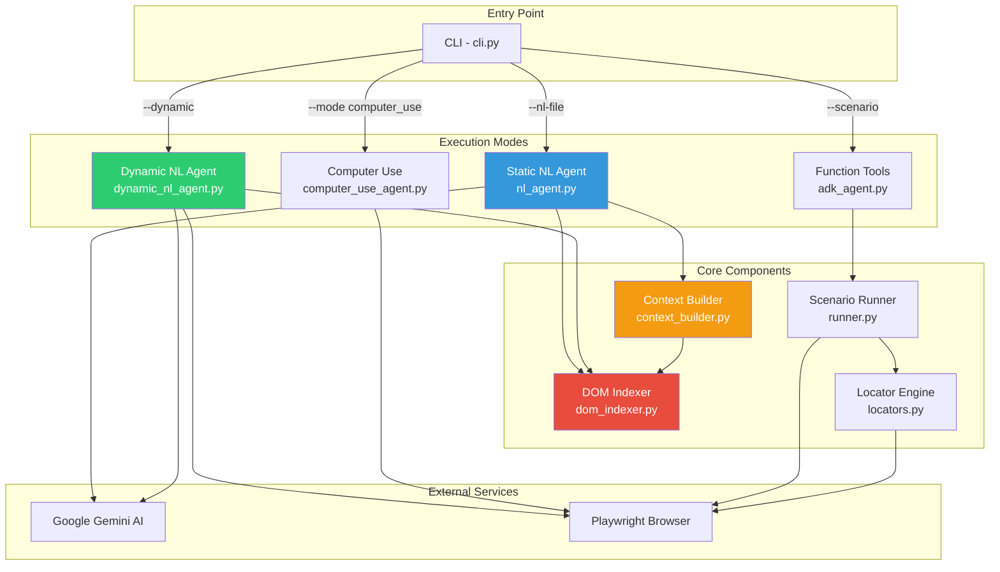

---

## Execution Modes

### 1. Dynamic NL Agent (NEW) 🚀

**Step-by-step decision making with real-time DOM observation**

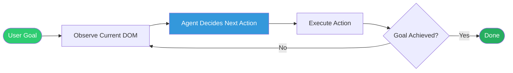

**Advantages:**
- ✅ Adapts to page changes in real-time
- ✅ No need to predict entire flow upfront
- ✅ Handles dynamic UIs (modals, notifications)
- ✅ Self-correcting on element changes

**Disadvantages:**
- ⚠️ Higher API cost (1 call per step)
- ⚠️ Slower execution
- ⚠️ Requires good prompt engineering

---

### 2. Static NL Agent

**Generate full test scenario upfront, then execute**

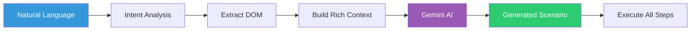

**Advantages:**
- ✅ Low API cost (1-2 calls total)
- ✅ Fast execution
- ✅ Predictable flow

**Disadvantages:**
- ⚠️ Can't adapt mid-execution
- ⚠️ Needs retry logic for failures

---

### 3. Function Tools Mode

**Deterministic YAML-based execution**

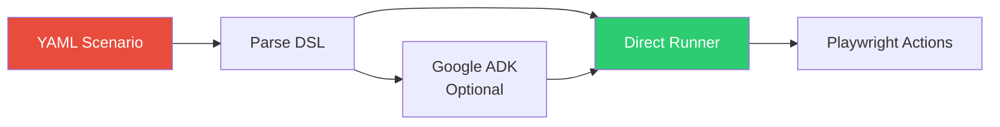

---

## Data Flow

### Dynamic NL Agent Flow

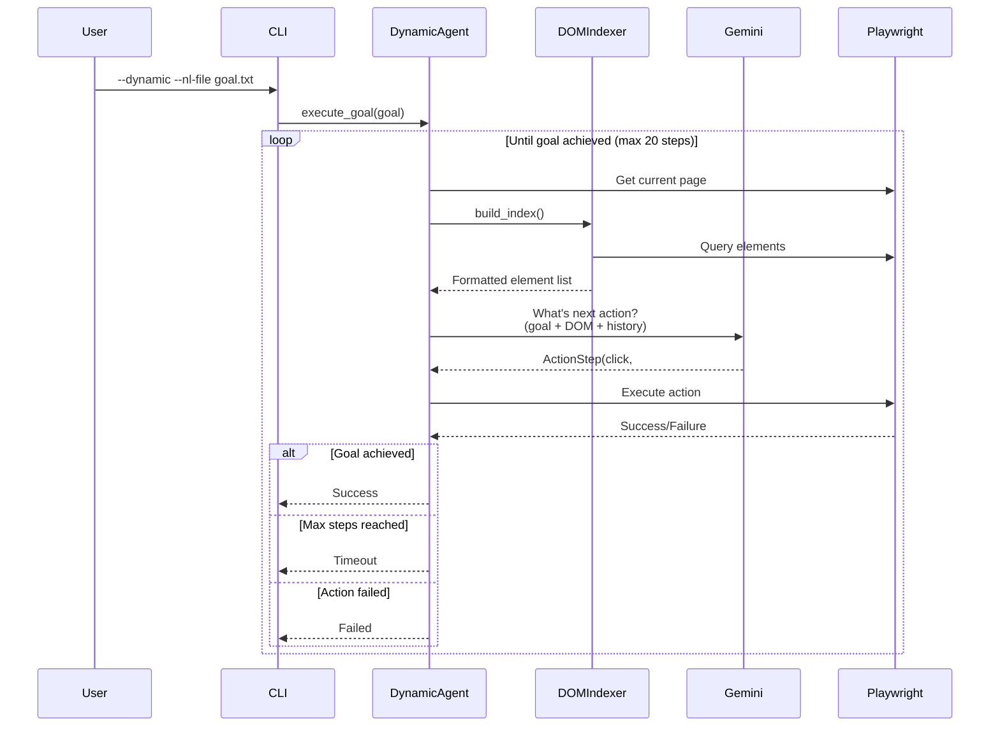

---

### Static NL Agent Flow

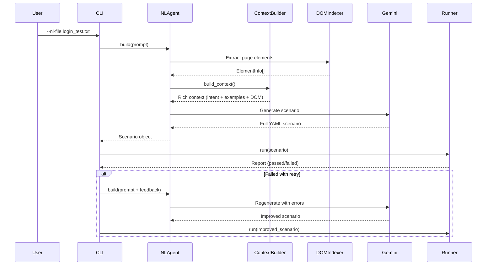

---

## Component Diagrams

### DOM Indexer Architecture

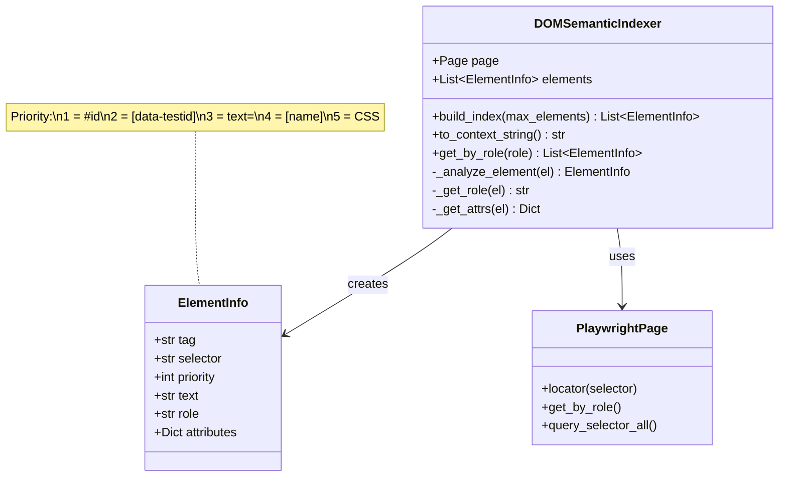

### Selector Priority System

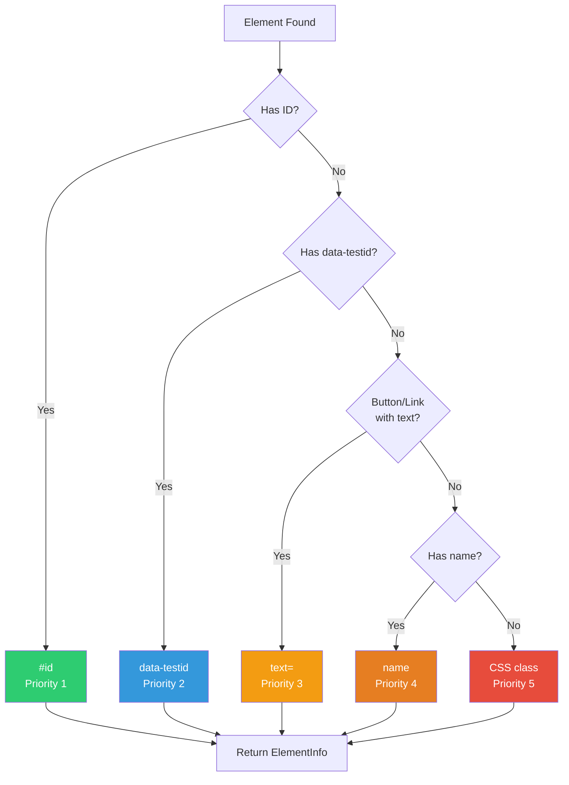

---

## Context Builder Pipeline

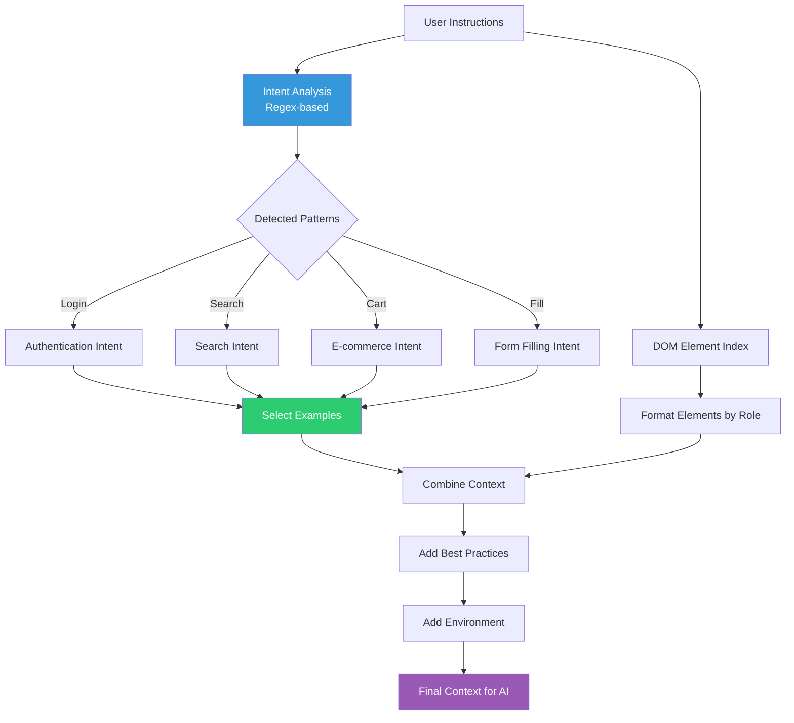

---

## Action Execution Flow

### Dynamic Agent Action Types

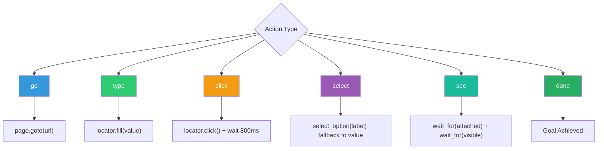

### Select Action (Enhanced)

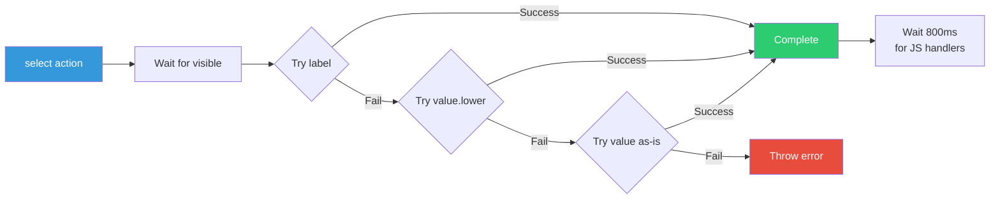

---

## Error Handling & Retry Logic

### Static NL Mode Retry

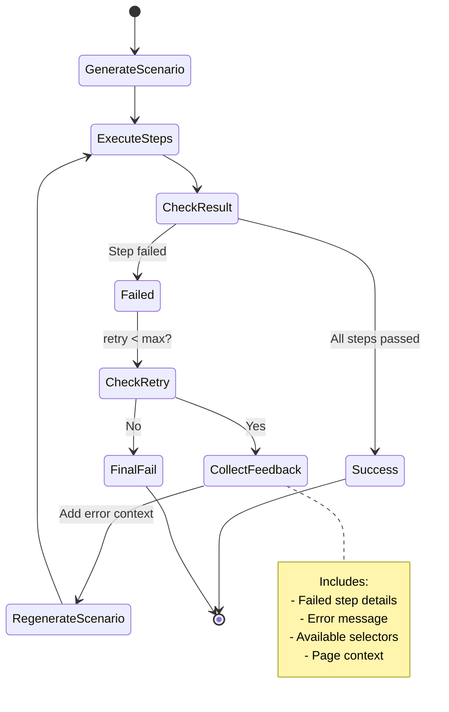

### Dynamic Agent Loop Prevention

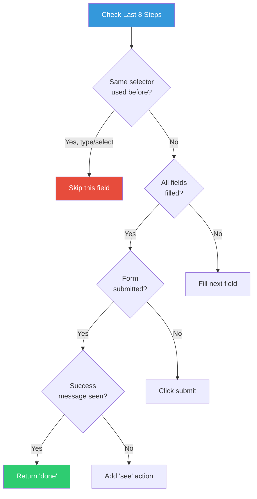

---

## Comparison Matrix

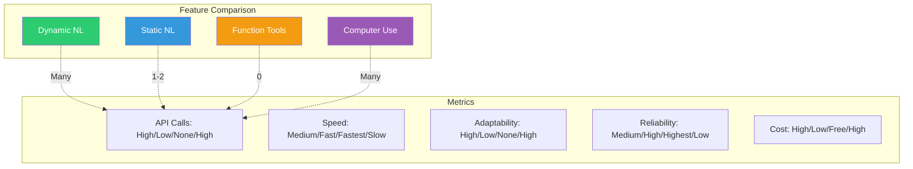

---

## Testing Strategy

### Test Execution Decision Tree

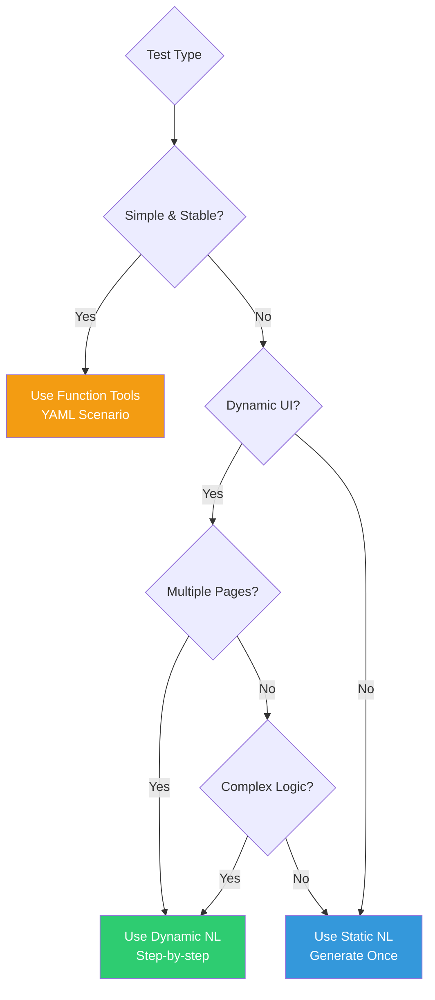

---

## Performance Characteristics

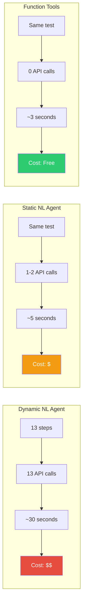

---

## Future Enhancements

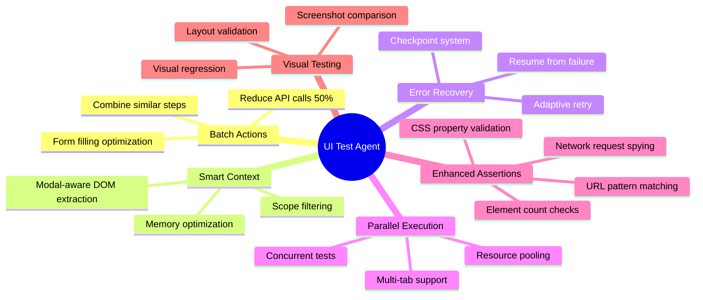

---

## Technology Stack

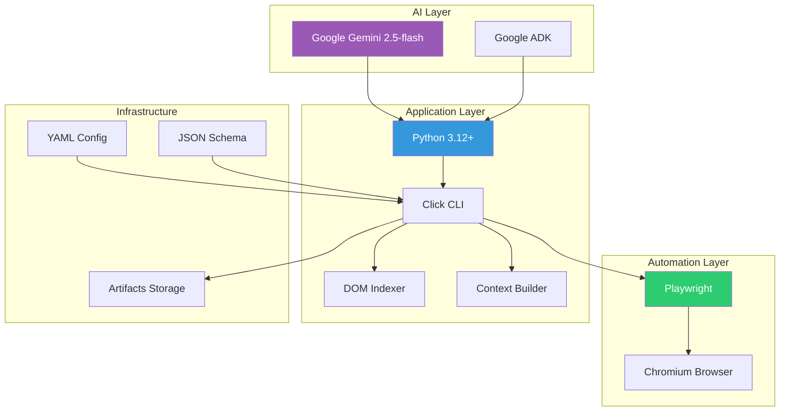

---

## Deployment Options

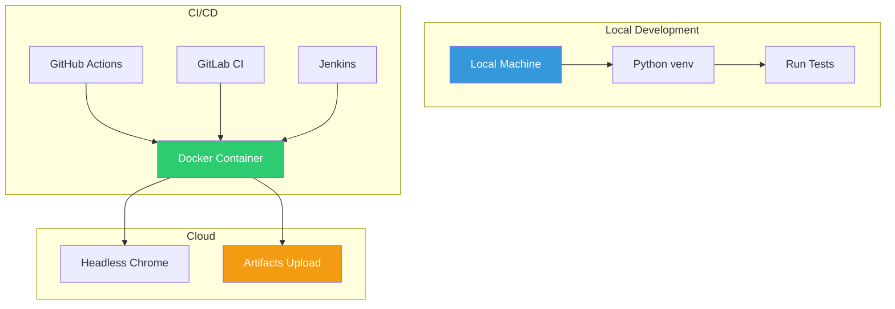

---

## Key Design Decisions

### 1. Why Multiple Modes?
- **Function Tools**: Best for stable, deterministic tests
- **Static NL**: Fast AI-powered test generation
- **Dynamic NL**: Maximum adaptability for complex UIs
- **Computer Use**: Vision-based fallback

### 2. Why DOM Indexer?
- Faster than HTML parsing
- Priority-sorted selectors
- Free (no API calls)
- Deterministic results

### 3. Why Context Builder?
- Reduces AI hallucination
- Intent-aware examples
- Best practices included
- Better than raw HTML

### 4. Why Gemini 2.5-flash?
- 15 RPM quota (vs 10 for 2.0-exp)
- Stable release
- Good cost/performance balance
- Function calling support

---

## License

MIT License - See [LICENSE](LICENSE) file
